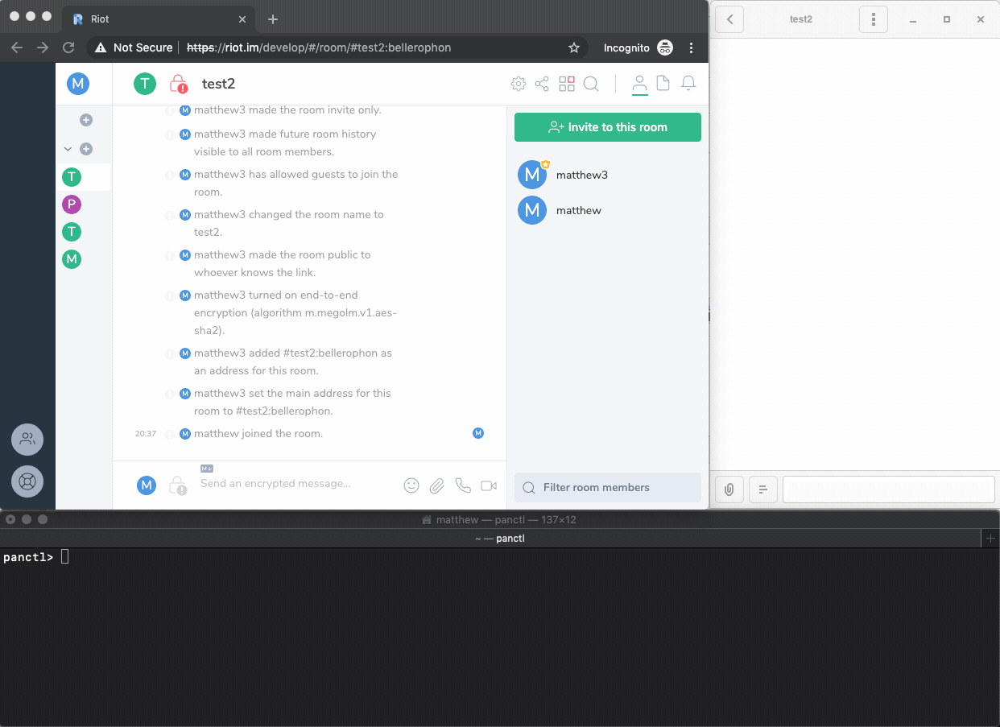

pantalaimon
===========

Pantalaimon is an end-to-end encryption aware Matrix reverse proxy daemon.
Pantalaimon acts as a good man in the middle that handles the encryption for you.

Messages are transparently encrypted and decrypted for clients inside of
pantalaimon.



Installation
============

The [Olm](https://gitlab.matrix.org/matrix-org/olm) C library is required to
be installed before installing pantalaimon.

If your distribution provides packages for libolm it is best to use those, note
that a recent version of libolm is required (3.1+). If your distribution doesn't
provide a package building from source is required. Please refer to the Olm
[readme](https://gitlab.matrix.org/matrix-org/olm/blob/master/README.md)
to see how to build the C library from source.

Installing pantalaimon works like usually with python packages:

    python setup.py install

Pantalaimon can also be found on pypi:

    pip install pantalaimon

Pantalaimon contains a dbus based UI that can be used to controll the daemon.
The dbus based UI is completely optional and needs to be installed with the
daemon:

    pip install pantalaimon[ui]

Do note that man pages can't be installed with pip.

### macOS installation

For instance, on macOS, this means:

```bash
brew install dbus
perl -pi -e's#(<auth>EXTERNAL</auth>)#<!--$1-->#' $(brew --prefix dbus)/share/dbus-1/session.conf
brew services start dbus
# it may be necessary to restart now to get the whole OS to pick up the
# existence of the dbus daemon

git clone https://gitlab.matrix.org/matrix-org/olm
(cd olm; make)
git clone https://github.com/matrix-org/pantalaimon
(cd pantalaimon; CFLAGS=-I../olm/include LDFLAGS=-L../olm/build/ python3 setup.py install)

export DBUS_SESSION_BUS_ADDRESS=unix:path=$(launchctl getenv DBUS_LAUNCHD_SESSION_BUS_SOCKET)
cd pantalaimon
DYLD_LIBRARY_PATH=../olm/build/ pantalaimon -c contrib/pantalaimon.conf

# for notification center:
git clone https://github.com/fakechris/notification-daemon-mac-py
# if you have django's `foundation` library installed and your filesystem
# is case insensitive (the default) then you will need to `pip uninstall foundation`
# or install PyObjC in a venv...
pip install PyObjC daemon glib dbus-python
cd notification-daemon-mac-py
./notify.py
```

### Docker

An experimental Docker image can be built for Pantalaimon, primarily for use in bots.

```bash
docker build -t pantalaimon .
# Create a pantalaimon.conf before running. The directory mentioned in the
# volume below is for where Pantalaimon should dump some data.
docker run -it --rm -v /path/to/pantalaimon/dir:/data -p 8008:8008 pantalaimon
```

An example `pantalaimon.conf` for Docker is:
```conf
[Default]
LogLevel = Debug
SSL = True

[local-matrix]
Homeserver = https://matrix.org
ListenAddress = 0.0.0.0
ListenPort = 8008
SSL = False
UseKeyring = False
IgnoreVerification = True
```

Usage
=====

While pantalaimon is a daemon, it is meant to be run as your own user. It won't
verify devices for you automatically, unless configured to do so, and requires
user interaction to verify, ignore or blacklist devices. A more complete
description of Pantalaimon can be found in the [man page](docs/man/pantalaimon.8.md).

Pantalaimon requires a configuration file to run. The configuration file
specifies one or more homeservers for pantalaimon to connect to.

A minimal pantalaimon configuration looks like this:
```dosini
[local-matrix]
Homeserver = https://localhost:8448
ListenAddress = localhost
ListenPort = 8009
```

The configuration file should be placed in `~/.config/pantalaimon/pantalaimon.conf`.

The full documentation for the pantalaimons configuration can be found in
the [man page](docs/man/pantalaimon.5.md) `pantalaimon(5)`.

Now that pantalaimon is configured it can be run:

    pantalaimon --log-level debug

After running the daemon, configure your client to connect to the daemon instead
of your homeserver. The daemon listens by default on localhost and port 8009.

Note that logging in to the daemon is required to start a sync loop for a user.
After that clients can connect using any valid access token for the user that
logged in. Multiple users per homeserver are supported.

For convenience a systemd service file is provided.

To control the daemon an interactive utility is provided in the form of
`panctl`.

`panctl` can be used to verify, blacklist or ignore devices, import or export
session keys, or to introspect devices of users that we share encrypted rooms
with.
